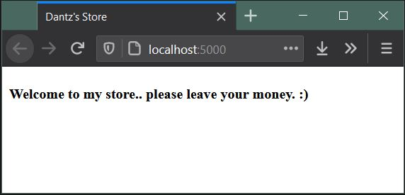
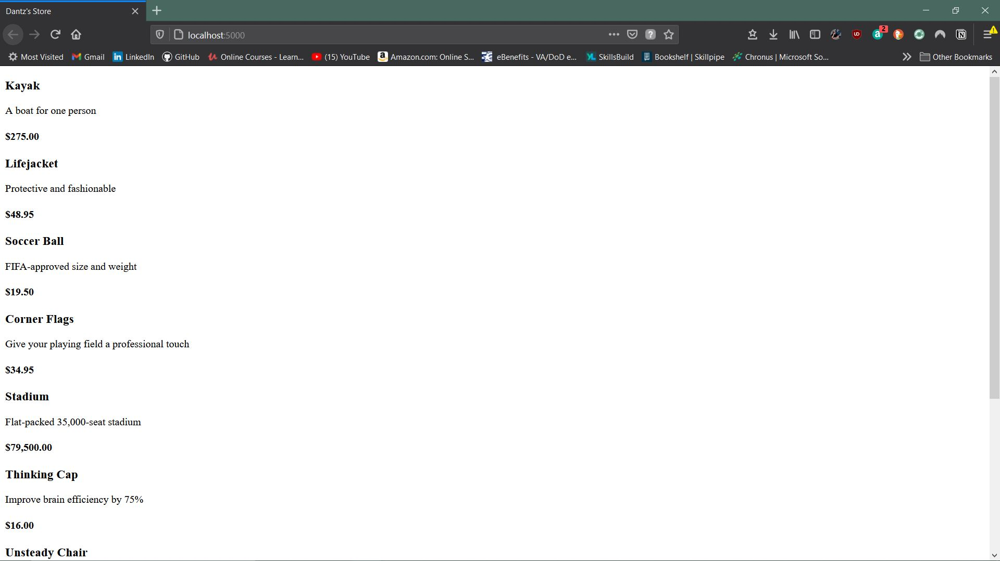
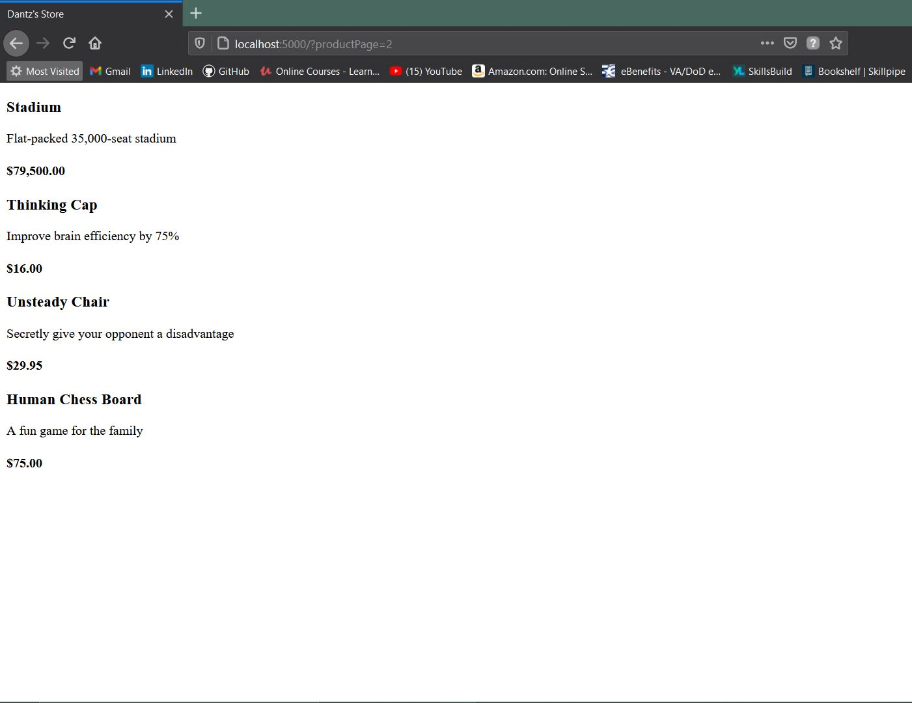
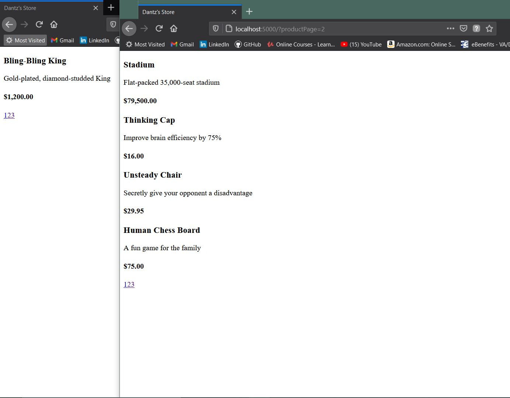
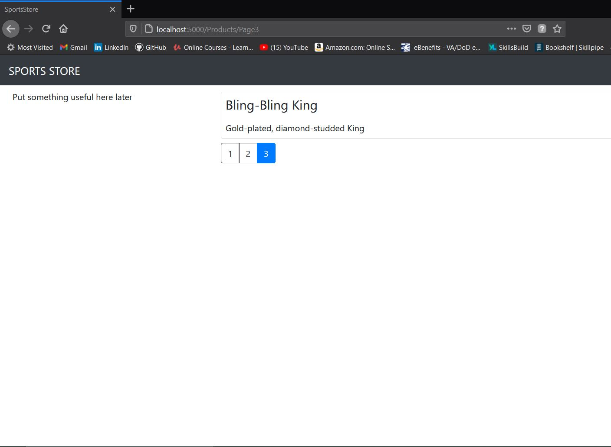

# DantzStoreSln
This is a build of a demo MVC app from Adam Freeman's ASP.NET Core 3 Textbook. This is for the purpose of demonstration.

## link
This is an exercise in Adam Freeman's Pro ASP.NET Core 3, Eighth Edition. For more information, follow this link:
[https://www.apress.com/gp/book/9781484254394.](https://www.apress.com/gp/book/9781484254394.)

## Build PowerShell Script

    dotnet new globaljson --sdk-version 5.0.201 --output DansStoreSln/OutdoorProducts
    dotnet new web --no-https --output DansStoreSln/OutdoorProducts --framework net5.0
    dotnet new sln -o DansStoreSln
    dotnet sln DansStoreSln add DansStoreSln/OutdoorProducts
    dotnet new xunit -o DansStoreSln/OutdoorProducts.Tests --framework net5.0
    dotnet sln DansStoreSln add DansStoreSln/OutdoorProducts.Tests 
    dotnet add DansStoreSln/OutdoorProducts.Tests reference DansStoreSln/OutdoorProducts
    
## Step 2
Project running after inital configuration...  

## Step 3
*What is Entity Framework?* 

It is Microsoft's Object-to-Relational Mapping (ORM) framework. 
It is used to link databases and web applications together. 

*What is a Connection String?* 

A connection string points your code toward a database to migrate to.
It is comprised of all the applicable information to connect to and access the database.

*What is a Database Context?* 

While connection strings allow for connection, Database Context is essentially a specific reference  
to the database that allows integration of the program Models to the database tables.

*What is a Model Repository?*

The repository layer separates the Business layer from the Data Access Layer.

*Migration vs Scaffolding?* 

Migration parses the C# Model data and plugs it into a database; Scaffolding takes a database and  
generates model code off of the data that adheres to MVC conventions.

*Seeding the database*:

## Step 4
Added page links, tests and styling  

    
